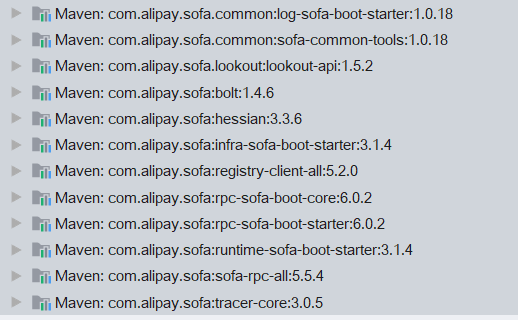
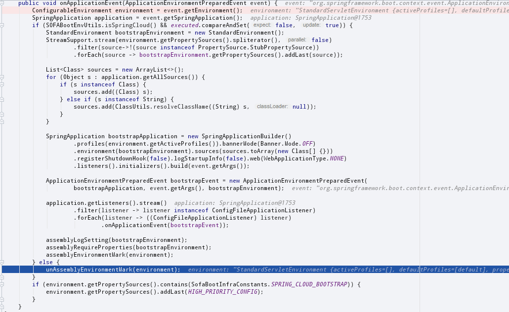
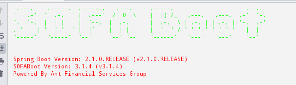
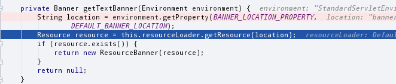
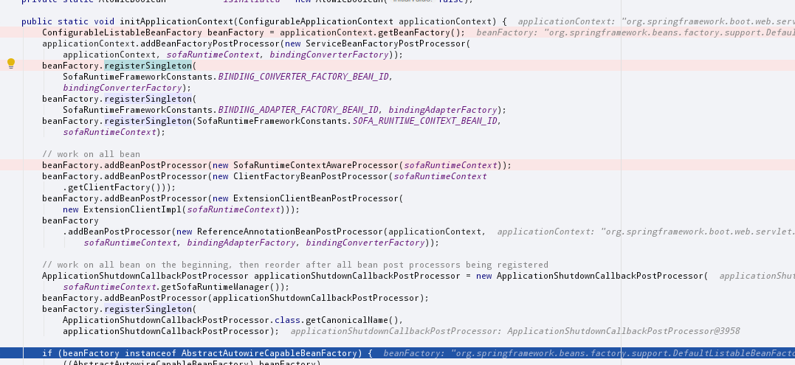

一、前面
SOFA（这个缩写沙发板凳么？不喜欢这个名字。。真的忍不住要吐槽。。但是看到全称又无可反驳啊。。）是蚂蚁金服18年开源的框架，详情不多说，稍微了解了一下，外面用的挺多的，上链接自己看   https://www.sofastack.tech/
既然一年前就开源了，就进去一探究竟。。。（其实没应用过，探索会不会get不到精髓呢）

二、搭建demo
先搞懂怎么用，搭建个demo，也不自己搭，因为发现sofa官方有现成的例子，一步步很容易入门啊。
1、按照官方文档例子搭建一个demo，用demo来debug，一步步跟着代码走起来；
2、官方给的快速搭建微服务的例子，跟着里面的步骤走，先把服务跑起来
https://www.sofastack.tech/guides/sofastack-quick-start/
3、demo中的配置只是例子，需要自行替换配置信息，我们先不关心其他内容，先由rpc调用入手，那么先修改application.properties  内容：
 # 1、添加服务注册中心地址
com.alipay.sofa.rpc.registry.address=sofa://127.0.0.1:9603，

记得demo中有两个工程，模拟的是服务使用方和提供方，分别都替换掉；
4、接着3，配置的内容选择了sofa的注册中心，所以我们需要自行下载一个注册中心并启动，提供注册中心服务（与dubbo注册中心类似，这个注册中心的协议是bolt（sofa基于netty实现的），也可以是zookper，默认是bolt），https://github.com/sofastack/sofa-registry/releases
注册中心也可以下载源码，自行编译，详见  https://www.sofastack.tech/projects/sofa-registry/server-quick-start/

5、有了注册中心和两个应用，服务就可以起来了，按照官方文档，先调通把页面余额数字展示出来现，完成一次基于sofa框架的服务调用后，你会发现这货跟dubbo的使用和原理都及其类似，这么一看心中大致有数了；

三、包分析
1、跟着官方走，服务已ok了，服务提供方和服务消费方都能在启动应用的时候走进断点了，那么我们可以一步步来探索下sofa框架了；
2、先来分析分析我们的工程引入了哪些sofa相关的包吧
重点的几个包我们来关注下（好几个源码还没看过，意思猜的，错了请轻喷）：
bolt：sofa基于netty实现的底层通讯协议，这个在rpc通讯过程中是sofa的默认协议，可以指定替换掉，也是开源的
registry-client-all: 封装了rpc调用的客户端相关代码，服务注册、服务调用均会用到这个封装包
rpc-sofa-boot-core: 结合springboot的内容实现
rpc-sofa-boot-starter:结合springboot的启动内容实现
sofa-rpc-all: sofa rpc的实现包

四、springboot方式下的代码探索
1、探索第一步的时候其实是比较难的，不知道如何下手，那么索性从头开始，从应用启动一步步往下探索，看看服务提供方应用和服务消费方应用在启动的时候都干了些啥？
2、我们以一个sotck-mng调用balance-mng的demo例子入手，先以从服务消费方应用sotck-mng的启动入手；
3、StockMngApplication.java main方法入手，标准的springboot启动方式；简单回顾下，springboot启动的时候都干了些啥：
1）、创建SpringApplication：准备好ApplicationContextInitializer和ApplicationListener，这些信息配置在各个jar包中的META-INFO中的spring.factiries，对于sofa来说也不例外，找到以下几个sofa相关的SofaBootRpcInitializer、SOFABootInfrastructureSpringContextInitializer、SofaRuntimeSpringContextInitializer，ApplicationListener就不列举了，准确的类其实可以debug进去看；
2）、执行run方法：执行SpringApplicationRunListeners ，listeners.starting() 启动所有的listeners，看代码可以知道spring根据不通的事件类型命令统一反射调用listeners，starting()方法命令参数为ApplicationStartingEvent，sofa并没有实现这个event的listener，基本上都是springboot的实现；
3）、继续run方法：执行到准备上下文ConfigurableEnvironment environment =prepareEnvironment(listeners,  applicationArguments); 代码跟入可以发现，触发到ApplicationEnvironmentPreparedEvent，sofa有实现的是以下几个类：SofaBootstrapRunListener,CommonLoggingApplicationListener，ApplicationEnvironmentPreparedListener
3.1）、先来看看SofaBootstrapRunListener干了啥：

不是springcloud的话，好像没干啥，先跳过吧。
3.2）、CommonLoggingApplicationListener也没做什么啊
3.3）、ApplicationEnvironmentPreparedListener，这个类把application.properties配置的
com.alipay.sofa.rpc.defaultTracer属性,如果配置了，就更新rpcconfig属性
3.4）、其他一些springboot做的事情就不细说了；

4）、printBanner(environment) 打印标志性文案，当然这里内容肯定变成sofa了

原理就是根据getTextBanner上的默认文件banner.txt，banner.txt存在infra-sofa-boot-starter包中，内容当然是打印出来的内容喽；

5）、createApplicationContext() 创建个上下文出来；
6）、prepareContext（）；
6.1)  、applyInitializers(context) 挨个执行ApplicationContextInitializer的initialize(context)方法，涉及到sofa的有以下几个类SOFABootInfrastructureSpringContextInitializer，SharedMetadataReaderFactoryContextInitializer，SofaBootRpcInitializer
6.1.1）、SOFABootInfrastructureSpringContextInitializer打印了一行日志
6.2.1）、SharedMetadataReaderFactoryContextInitializer ，初始化CachingMetadataReaderFactoryPostProcessor添加到上下文
6.3.1）、SofaBootRpcInitializer    设置日志相关的信息
6.4.1）、SofaRuntimeSpringContextInitializer  ：开始构造rpc client，sofaRuntimeContext（）方法：注册reference和service的客户端信息; 然后进入initApplicationContext(applicationContext)方法：定义一些BeanPostProcessor和单例工厂类，注册到spring bean中去，

6.2）、listeners.contextPrepared(context)这个玩意没有sofa的拓展
6.3）、bean工厂把springApplicationArguments注册进去，把printedBanner也注册进去
6.4）、load（）  没看懂。。尴尬。。
6.5）、listeners.contextLoaded(context)  ,又来一次哦，类型是ApplicationPreparedEvent,但是都是springboot的实现，并没有sofa的个性化实现；
7)、refreshContext(context)，spring刷新上下文的操作，里面是spring的操作，上面sofa新建的工厂类啊，bean之类的都托管到spring上下文中去了；
8）、listeners.started(context)：都是spring的操作，sofa无特别操作
9）、listeners.running(context)：sofa无特别操作